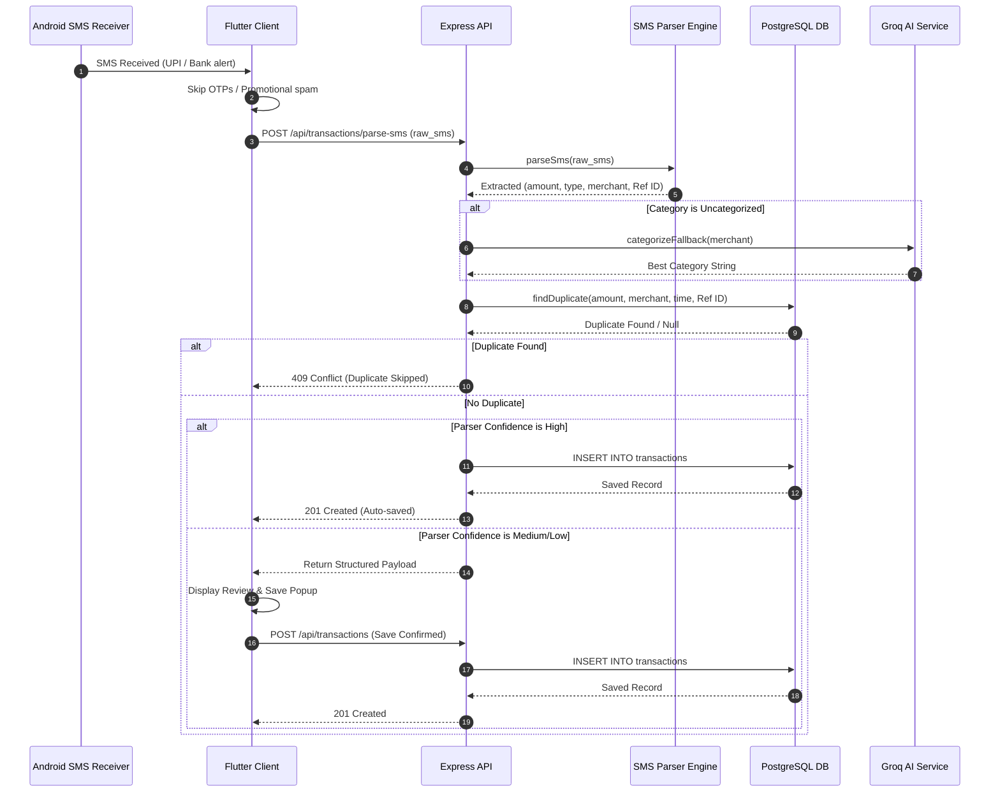

# BudgetBuddy 🎓💰
> AI-Powered Automatic Money Tracker & Financial Coach for Students

BudgetBuddy is a production-ready personal finance tracker built specifically for students. It automatically intercepts bank/UPI transaction notifications, parses them using a custom parser, predicts end-of-month budget deficits, scores discipline, and provides a conversational AI financial assistant to help students avoid overspending.

---

## 🚀 Key Features

* **📱 Android SMS Auto Import:** Listen to incoming transaction SMS alerts in the background. High-confidence transactions are saved instantly; lower confidence items display a quick review-and-save prompt.
* **🤖 Conversational Finance Coach:** Ask questions (e.g., *"How much did I spend on Food?"*, *"Where can I save?"*) and get replies grounded securely in your transaction history using Groq.
* **🎙️ Voice Transactions:** Convert verbal commands (e.g., *"Spent 300 rupees on dinner"*) into fully structured transaction entries.
* **📈 Discipline Scoring (0-100):** Gamify savings! Get scored based on budget overrun risk, merchant concentrations, category concentrations, and daily safe limits.
* **🛡️ Secure PIN Lock:** Protect transaction logs from phone-snatching using a custom numeric keypad lock screen. Hashed with bcrypt and fortified with brute-force lockouts.
* **📊 Visual Analytics:** Premium charts showing category-wise expense distribution and remaining daily safe limits.

---

## 🏛️ System Architecture

BudgetBuddy divides responsibilities using a modular clean architecture model:

```
                  ┌──────────────────────┐
                  │   Flutter Frontend   │
                  │   (Provider State)   │
                  └──────────┬───────────┘
                             │ (HTTPS)
                             ▼
                  ┌──────────────────────┐
                  │    Express JS API    │
                  └──────────┬───────────┘
                             │
            ┌────────────────┴────────────────┐
            ▼                                 ▼
┌──────────────────────┐            ┌──────────────────────┐
│  Analytical Engines  │            │  PostgreSQL Database │
│   (Balance, Groq,    │            │ (Users, Transactions,│
│    Insights, SMS)    │            │  Budgets, Audit Logs)│
└──────────────────────┘            └──────────────────────┘
```

### SMS Import Sequence Flow
The diagram below details how transaction alerts are intercepted, parsed, checked for duplicates, and committed to the database:



---

## 🗄️ Database Schema

### `users`
Tracks profiles, hashed app security PINs, and failed security attempts for lockout management.
* `id` (SERIAL PRIMARY KEY)
* `name`, `email` (UNIQUE), `password_hash`, `phone`
* `pin_hash` (bcrypt PIN lock code)
* `failed_login_attempts`, `locked_until`
* `failed_pin_attempts`, `pin_locked_until`
* `refresh_token_hash`

### `transactions`
Logs all verified expenses and income credits.
* `id` (SERIAL PRIMARY KEY)
* `user_id` (FOREIGN KEY)
* `amount`, `type` ('income', 'expense')
* `merchant_or_sender`, `category`
* `source` ('sms', 'manual'), `note`, `transaction_date`
* `raw_sms`, `reference_number` (UTR transaction ID)

### `budget_settings`
Specifies starting pocket money limits for month/year configurations.
* `id` (SERIAL PRIMARY KEY)
* `user_id` (FOREIGN KEY)
* `month`, `year`, `pocket_money`

---

## 🚀 Setup & Running Instructions

### Backend Setup
1. Clone the repository and navigate to the backend directory:
   ```bash
   cd backend
   npm install
   ```
2. Create a `.env` file from the template:
   ```bash
   cp .env.example .env
   ```
3. Open `.env` and fill out your PostgreSQL credentials and Groq API Key:
   ```env
   DB_HOST=localhost
   DB_NAME=campuscash
   DB_USER=postgres
   DB_PASSWORD=yourpassword
   GROQ_API_KEY=your_groq_api_key
   ```
4. Run migrations to initialize the database:
   ```bash
   npm run db:migrate
   ```
5. Start the server:
   ```bash
   npm run dev
   ```

### Flutter Frontend Setup
1. Install Flutter dependencies:
   ```bash
   flutter pub get
   ```
2. Connect a device or start an emulator.
3. Start the application:
   ```bash
   flutter run
   ```
